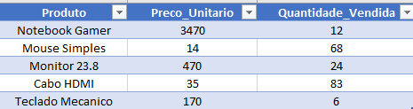
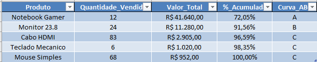

# 📦 Calculadora de Curva ABC (Logística & Python)

Este projeto é uma ferramenta de automação para análise de estoque baseada no **Princípio de Pareto (80/20)**. O script lê uma base de dados de produtos em Excel, processa os valores financeiros e classifica automaticamente os itens nas categorias A, B ou C, gerando um relatório final já formatado.

## 📷 Demonstração

### 1. Entrada de Dados (Simulação)
A planilha original contém apenas os produtos, preços e quantidades vendidas, sem nenhuma inteligência de dados aplicada.

<div align="center">

</div>

### 2. Resultado Final (Processado pelo Python)
O script calcula o faturamento total, a porcentagem acumulada e define a classe. O output é um arquivo Excel novo, formatado automaticamente com **R$** e **%**.

<div align="center">

</div>

---

## 📚 O que é a Curva ABC?

A **Curva ABC** é uma metodologia essencial na Logística e Gestão da Qualidade para classificar informações por grau de importância. Ela ajuda gestores a focar esforços onde realmente traz resultado financeiro.

### Como funciona a classificação?
* **🟢 Classe A (Alta Importância):** Representam cerca de **80% do faturamento**, mas geralmente são poucos itens (aprox. 20% do total).
    * *Exemplo:* Notebooks, equipamentos caros.
    * *Ação:* Controle rigoroso de estoque e inventário frequente.
* **🟡 Classe B (Importância Média):** Representam cerca de **15% do faturamento**.
    * *Exemplo:* Monitores, impressoras.
    * *Ação:* Controle moderado.
* **🔴 Classe C (Baixa Importância):** Representam apenas **5% do faturamento**, mas são a grande maioria dos itens físicos (aprox. 50% ou mais do total).
    * *Exemplo:* Cabos, parafusos, itens de escritório.
    * *Ação:* Estoque de segurança maior e compras automatizadas.

---

## 🛠️ Tecnologias Utilizadas
* **Python 3.x**
* **Pandas** (ETL e Análise de Dados)
* **XlsxWriter** (Engine para formatação condicional e estilos no Excel)
* **OpenPyXL** (Leitura de arquivos .xlsx)

---

## 🚀 Como Executar o Projeto

Siga os passos abaixo no seu terminal para rodar o projeto:

### 1. Clonar o repositório
```bash
git clone [https://github.com/rhaycosta/abc-curve-logistics.git](https://github.com/rhaycosta/abc-curve-logistics.git)
cd abc-curve-logistics
```

### 2. Criar o Ambiente Virtual (Recomendado)
```bash
# Windows
python -m venv .venv
.venv\Scripts\activate

# Linux/Mac
python3 -m venv .venv
source .venv/bin/activate
```

### 3. Instalar as dependências
```bash
pip install -r requirements.txt
```

### 4. Executar o Script
Certifique-se de que o arquivo `produtos.xlsx` esteja na pasta `data/` e rode:
```bash
python src/main.py
```

✅ **Pronto!** O relatório será gerado na pasta `data/` com o nome `relatorio_abc.xlsx`.

---
